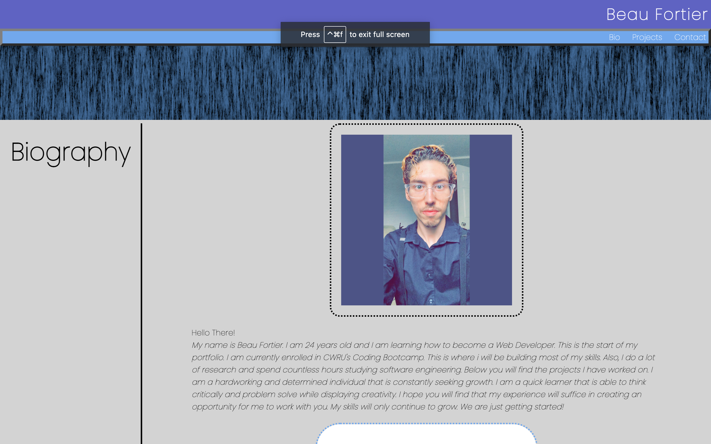
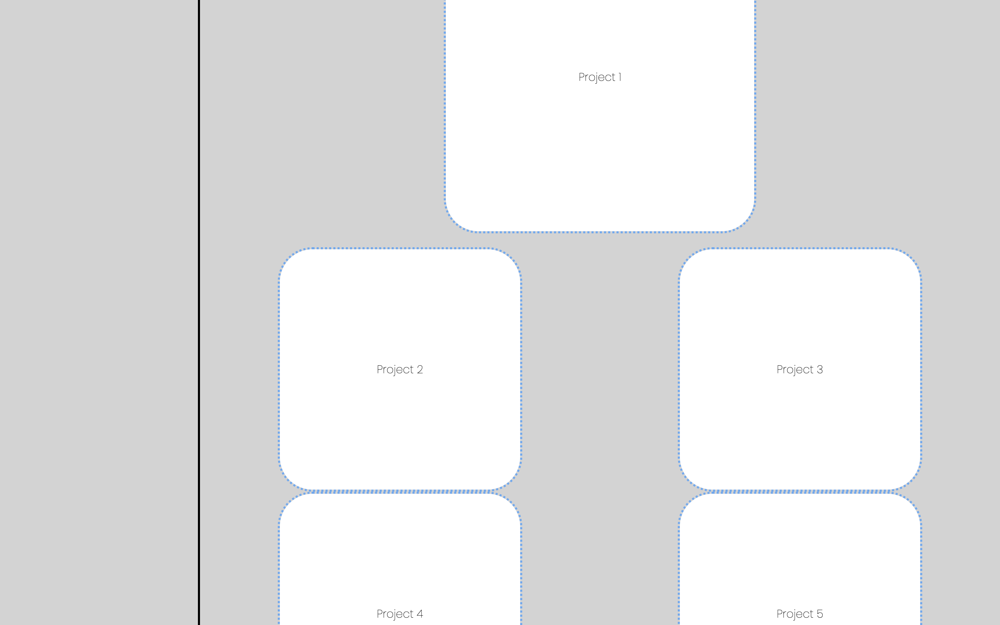
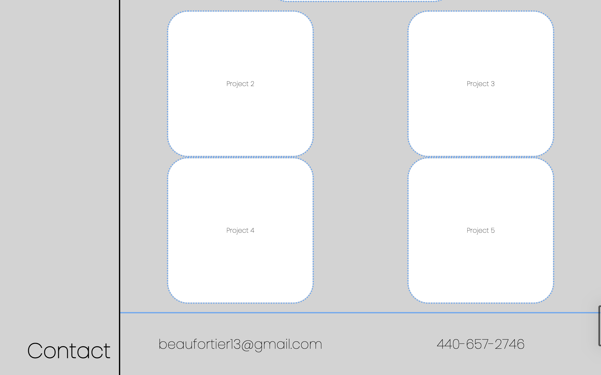

# Beau-Portfolio

**This is a rough draft of my professional portfolio**

## HTML

* I started with a basic layout of an html document.
* I linked my CSS document and a custom font.
* I created my header and navigation bar.
* I linked my navigation bar ID's to their designated areas.
* I made an image to put under my header for style.
* I created an aside section for my sidebar.
* i created a main area to hold all my sections.
* I put the aside before the main so it would be positioned on the left.
* I created an area for my picture and biography.
* I created a section for my projects.
* I created a section for my contact information.

## CSS

* I started with a few propeties to reset the CSS.
* I created a main flex-box for my body.
* I styled and positioned the header and the navigation bar.
* I styled my aside section with another flex-box.
* I styled my main section within my body to make a new flex-box while also positioning it into my first flex-box.
* I positioned and styled the image of myself at the top of my page with my biography underneath.
* I created another flex-box within my projects section.
* I styled and positioned my projects by giving them borders and titles in the center.
* The projects have placeholder images that change appearence upon hovering above them
* I created yet another flexbox to position my contact information. 
* I styled my contact information.

## LINKS

### GitHub Repo: 
https://github.com/beau4ta/Beau-Portfolio

### Live Webpage:
https://beau4ta.github.io/Beau-Portfolio/

